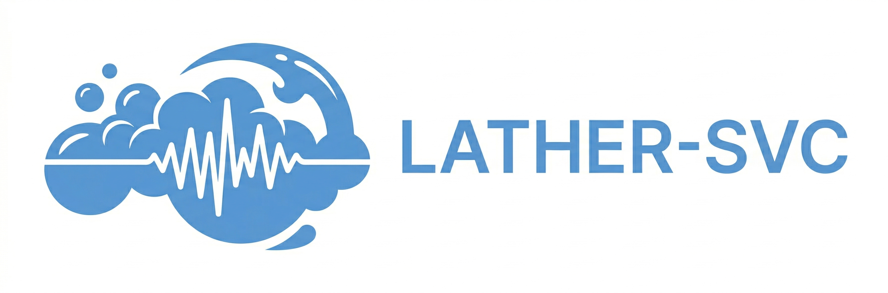

# LATHER-SVC

<p align="center">
  
</p>

**Lightweight Audio Timbre Harmonization and Expression Rendering — SVC**

## 简介

LATHER-SVC 是一个基于 Rectified Flow 的多说话人歌声转换（Singing Voice Conversion）系统。项目基于 DSRX（DiffSinger fork）代码库改造，删除了所有 SVS（歌声合成）相关模块，保留并改进了 diffusion/vocoder/training 基础设施。

核心特色在于：**在 SVC 中首个引入显式唱法参数预测**。通过 Variance Predictor 预测 breathiness（气声）、tension（张力）、voicing（发声）三个参数，让每个说话人学到自己独特的唱法习惯，从而提升转换后的表现力和自然度。

LATHER-SVC 是 Kouon Project 旗下项目。

## 特性

- **显式唱法建模**：通过 Variance Predictor 预测 breathiness/tension/voicing，每个说话人具备独立的唱法风格
- **双模式推理**：音质优先（44.1kHz, 20 步采样）和速度优先（24kHz, 4 步采样）
- **Rectified Flow + Shallow Diffusion**：从 ConvNeXt aux decoder 的粗略预测出发，Rectified Flow 仅从 t=0.4 开始精修，兼顾质量与速度
- **ContentVec Layer Attention**：可选融合第 7-12 层特征，自适应提取最优内容表示
- **多说话人支持**：Embedding lookup table，单模型支持多说话人训练与推理
- **基于 DSRX 成熟基础设施**：继承 PyTorch Lightning 训练框架、Muon_AdamW 优化器、完整的数据增强和验证流程

## 架构概览

<p align="center">
  
</p>

前向流程：

1. 源音频 → ContentVec-768 提取内容特征 + RMVPE 提取 F0 + Speaker Embedding
2. 三者相加 → Condition Refiner（4 层 Transformer + RoPE）做跨帧上下文建模
3. Variance Predictor 从条件特征预测 breathiness/tension/voicing → 嵌入回条件
4. ConvNeXt Aux Decoder 输出粗略 mel → Rectified Flow（LYNXNet2）从 t=0.4 精修
5. NSF-HiFiGAN 合成 44.1kHz 音频

## 环境要求

- Python >= 3.10
- PyTorch >= 2.0（推荐 2.1+）
- CUDA >= 11.8（推荐 12.x）
- 显存需求：训练 ≥ 12GB，推理 ≥ 6GB
- 其他依赖见 `requirements.txt`

## 快速开始

### 安装

```bash
git clone <repo_url> LATHER-SVC
cd LATHER-SVC
pip install -r requirements.txt
```

**安装 fairseq**（ContentVec 依赖，不能直接 `pip install fairseq`）：

```bash
# 从 GitHub 源码安装
pip install git+https://github.com/facebookresearch/fairseq.git

# 如果上述方式出错，尝试克隆后本地安装
git clone https://github.com/facebookresearch/fairseq.git
cd fairseq
pip install -e .
cd ..
```

> **注意**：fairseq 在较新的 Python 版本（3.10+）上可能遇到构建问题。如果遇到 numpy 或 Cython 相关错误，尝试先安装 `pip install numpy<2.0 cython`，再安装 fairseq。作为替代方案，ContentVec 也支持通过 `transformers` 库的 `HubertModel` 加载，此时不需要 fairseq。

**下载预训练模型**：

| 模型                               | 存放路径                                            | 下载链接                                                                                                                                    |
| -------------------------------- | ----------------------------------------------- | --------------------------------------------------------------------------------------------------------------------------------------- |
| ContentVec-768                   | `ckpt/contentvec/checkpoint_best_legacy_500.pt` | [HuggingFace](https://huggingface.co/lengyue233/content-vec-best/resolve/main/checkpoint_best_legacy_500.pt)                            |
| RMVPE                            | `ckpt/rmvpe/RMVPE.pt`                           | [HuggingFace](https://huggingface.co/lj1995/VoiceConversionWebUI/resolve/main/rmvpe.pt)                                                 |
| NSF-HiFiGAN (Kouon Ver. 44.1kHz) | `ckpt/nsf-hifigan/`                             | [GitHub Release](https://github.com/Kouon-Project/Kouon_Vocoder/releases/download/V2.0.0/kouon_pc_mini_nsf-hifigan_1028_generators.zip) |
| （可选）VR harmonic-noise separation | `ckpt/vr/model.pt`                              | <!-- TODO: 下载链接 --> TBD                                                                                                                 |

### 数据准备

数据目录结构：

```
dataset/
├── speaker_A/
│   ├── 001.wav
│   ├── 002.wav
│   └── ...
└── speaker_B/
    ├── 001.wav
    └── ...
```

要求：

- 干声 wav 文件（建议先做人声分离）
- 建议每个切片 5-15 秒
- 每个说话人建议 30 分钟以上数据

在 `configs/svc_base.yaml` 的 `datasets` 段中注册数据集：

```yaml
datasets:
  - raw_data_dir: /path/to/speaker_A
    speaker: speaker_A
    spk_id: 0
    language: zh
    artifact_level: 0
    test_prefixes:
      - some_test_file_prefix

  - raw_data_dir: /path/to/speaker_B
    speaker: speaker_B
    spk_id: 1
    language: en
    artifact_level: 0
    test_prefixes:
      - another_test_prefix
```

同时更新 `num_spk` 为你的说话人总数。

### 预处理

```bash
python scripts/binarize.py --config configs/config_quality.yaml
```

预处理会执行以下操作：

- 提取 mel spectrogram
- 使用 RMVPE 提取 F0
- 使用 ContentVec-768 提取内容特征（提前缓存各层 hidden states）
- 提取 breathiness/voicing/tension 三个 variance 参数
- 将所有数据打包为二进制索引数据集

### 训练

```bash
python scripts/train.py --config configs/config_quality.yaml --exp_name my_experiment
```

关键训练参数（在 `svc_base.yaml` 中配置）：

- `max_updates`: 总训练步数（默认 160000）
- `max_batch_frames`: 每 batch 最大帧数（默认 48000）
- `val_check_interval`: 验证间隔（默认 2000 步）
- `pl_trainer_precision`: 训练精度（默认 `16-mixed`）

查看 TensorBoard：

```bash
tensorboard --logdir checkpoints/my_experiment/lightning_logs
```

### 推理

**CLI**：

```bash
python scripts/infer.py \
  --config configs/config_quality.yaml \
  --exp_name my_experiment \
  --input source.wav \
  --output output.wav \
  --speaker speaker_A \
  --pitch_shift 0
```

**WebUI**：

```bash
python webui.py \
  --quality_config ckpt/my_experiment/config.yaml \
  --quality_exp_name my_experiment \
  --port 7860
```

### 双模式说明

|          | 音质优先                          | 速度优先                       |
| -------- | ----------------------------- | -------------------------- |
| 采样率      | 44.1kHz                       | 24kHz                      |
| Hop size | 512                           | 300                        |
| Mel 帧率   | ~86Hz                         | 80Hz                       |
| 采样步数     | 20                            | 4                          |
| 配置文件     | `configs/config_quality.yaml` | `configs/config_fast.yaml` |

- 两者是独立训练的模型，共享代码但不共享权重
- 需要分别进行预处理和训练
- Vocoder 统一使用 44.1kHz NSF-HiFiGAN，速度优先模式通过 mel 插值上采样对接

## 配置文件说明

详细配置说明见 [docs/Configuration.md](docs/Configuration.md)。

## 与相关项目的区别

| 特性                | LATHER-SVC                   | RVC            | So-VITS-SVC         | RIFT-SVC       |
| ----------------- | ---------------------------- | -------------- | ------------------- | -------------- |
| 生成范式              | Rectified Flow               | GAN (HiFi-GAN) | VITS (VAE+Flow+GAN) | Rectified Flow |
| 表现力控制             | 显式 (B/V/T predictor)         | 无              | 无                   | 无              |
| Backbone          | LYNXNet2                     | -              | WaveNet             | DiT            |
| Content Encoder   | ContentVec + Layer Attention | HuBERT         | SoftVC / ContentVec | Whisper / CFG  |
| Shallow Diffusion | ✓ (t=0.4)                    | ✗              | ✗                   | ✗              |

## 致谢

- [DSRX / DiffSinger](https://github.com/openvpi/DiffSinger) — 基础代码库
- [ContentVec](https://github.com/auspicious3000/contentvec) — 内容特征提取
- [RMVPE](https://github.com/Dream-Fang/RMVPE) — F0 提取
- NSF-HiFiGAN — 声码器
- Kouon Project 相关项目：SOAP, RINSE, Kouon NSF-HiFiGAN

## 许可证

TBD
